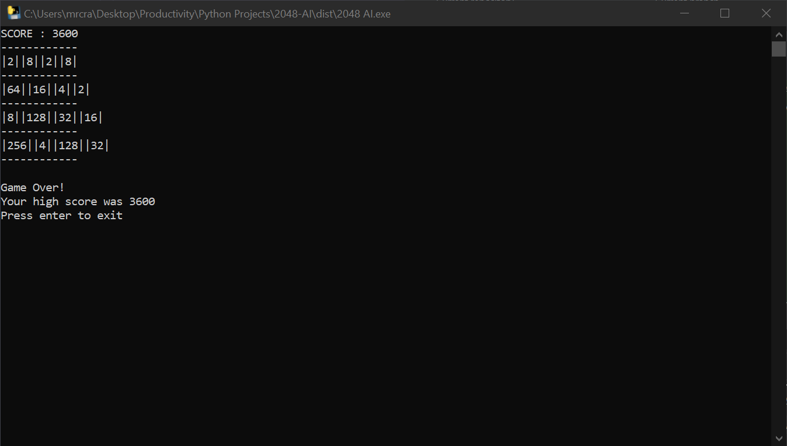

<!-- PROJECT LOGO -->
 

  

<h3 align="center">2048 AI</h3>

  

     A Python console executable that implements minimax algorithm for 2048.
  

  
Table of Contents

  <ol>
    <li>
      <a href="#project-demo">Project Demo</a>
    </li>
    <li>
      <a href="#built-with">Built With</a>
    </li>
    <li>
      <a href="#installation">Installation</a>
    </li>
    <li>
        <a href="#usage">Usage</a>
    </li>
    <li>
        <a href="#implementation">Implementation</a>
        <ul>
          <li>
            <a href="#base-2048-game">Base 2048 Game</a>
          </li>
          <li>
            <a href="#ai">AI</a>
          </li>
        </ul>
    </li>
    <li>
        <a href="#contact">Contact</a>
    </li>
  </ol>

## Project Demo

(<a href="#readme-top">back to top</a>)

## Built With

* [Python](https://www.python.org/downloads/)

(<a href="#readme-top">back to top</a>)

## Installation

* Download the executable at [here](https://www.mediafire.com/file/qdxziaxhof6ieu7/2048_AI.exe/file)

(<a href="#readme-top">back to top</a>)

## Usage

* Enter 0 to play normal 2048 or 1 to see the AI play 2048.

(<a href="#readme-top">back to top</a>)

## Implementation

### Base 2048 Game

* Technically speaking, because of the board being list of size 16, the board can only shift to the left. The way that the board can shift in other direction is by rotating the board either 90 degrees to the left or 90 degrees to the right. For example, to shift the board downward: the board rotates 90 degrees to the right, shifts left, and then rotates 90 degrees to the left.
* The board will check if the requested shift is valid by seeing if there are any open spaces in the direction of the shift. If all four directions of shifts are invalid, the game will end. 
* After every move, the board is scanned for any open spaces and randomly selects one for a new tile. This is the advantage of making the board out of a list.
* The numbers 1-7 represent each column of the Connect Four board.
* The scoring system for the [minimax algorithm](https://www.youtube.com/watch?v=KU9Ch59-4vw&ab_channel=GauravSen) is calculated based on different direction of four consecutive board spots. Examples of these consecutive board spots can be find below.
* Each combination of four spots are matched to a dictionary. The keys of the dictionary are tuples where the first value is the count of the current player and the second value is the count of the empty spaces. The values of the dictionary are the different score values.
* Each added score from the above dictionary alternates between positive for the player and negative for the AI. This is so that the minimax algorithm can easily maximize for the player by increasing the score towards infinity while minimizing for the AI by decreasing the score towards negative infinity. 

### AI

* Scoring for the [minimax function](https://www.youtube.com/watch?v=KU9Ch59-4vw&ab_channel=GauravSen) takes in multiple different factors: keeping the largest tile in one corner of the board, the putting two equal tiles next to each other so that they can be added together, creating adding opportunities, and keeping the overall tile count down.
* The 2 "players" for the minimax algorithm are the "AI Player", the maximizing player, and "nature", the minimizing player. 
* When it is nature's turn, the algorithm factors in all of the open space and hypothetically places a new "2" and "4" tile in it. This is done for every possible outcome based on the player's move, and its main goal is the give the player the worst possible tile placement.
* When it is the "AI Player's" turn, the algorithm the best lowest score that could come from each of his possible moves.
* A more in-depth explanation can be found [here](https://www.youtube.com/watch?v=0fOLkZJ-Q6I&ab_channel=MichaelSchrandt)

## Contact

Larry Ling - [website](larryling.me) - larryling.main@gmail.com

Project Link: [https://github.com/HecticBanzai/2048-AI](https://github.com/HecticBanzai/2048-AI)

(<a href="#readme-top">back to top</a>)

[product-screenshot]: images/demo.png